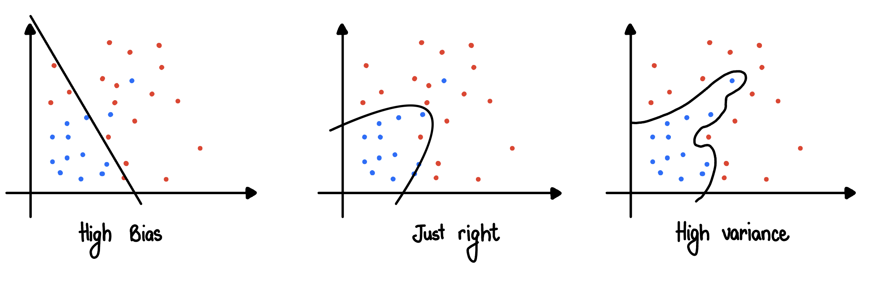

# Practical Aspect of Deep Learning

Since I had to write mathematical expression in latex, I used Jupyter notebook for that purpose. Use Introduction file above as a README. 

# Train / Dev / Test Sets

For a lot of applications in deep learning, it is almost impossible to guess/get the values of hyperparameters correctly the first time. So, the applied deep learning is a very iterative process where we have to go around a cycle of "Idea", "Code" and "Experiment", and find a good choice of network for our application.

So, one of the things that determine how quickly you can make progress is how efficiently you can go around this cycle. Setting up your data sets in terms of training, development and test sets can make you much more efficient at that.

## Bias/Variance 

Seeing the above plots, we can conclude that the first plot is underfitting the dataset and the right most is overfitting the dataset. In 2-D, it is quiet easy to visualize the trends through plots, but in higher dimension, it gets impossible to see it through graphs.

<table style="width:100%">
    <tr>
        <td>  </td> 
        <td> <b>First try</b> </td> 
        <td> <b>Second try</b>  </td> 
        <td> <b>Third try</b> </td>
        <td> <b>Fourth Try</b> </td> 
    <tr>
    <tr>
        <td> <b> Train Set Error</b> </td> 
        <td> 1% </td> 
        <td> 15% </td> 
        <td> 15% </td> 
        <td> 0.5% </td> 
    <tr>
    <tr>
        <td> <b>Dev Set Error</b> </td> 
        <td> 11% </td> 
        <td> 16% </td> 
        <td> 30%  </td> 
        <td> 1% </td> 
    <tr>
    <tr>
        <td> <b>Bias / Variance </b> </td> 
        <td> High Variance </td> 
        <td> Underfitting the data = High Bias </td> 
        <td> High Bias $\&$ High Variance </td> 
        <td> Low Bias $\&$ Low Variance </td> 
    <tr>
</table>

Suppose the above table is constructed upon classifying images: cat or not a cat. 

Then, this analysis is predicted on the assumption that Human level performance gets nearly $0\%$ error. More generally, the optimaly error (or the Bayes Error) is nearly 0%.

If the optimal (Bayes Error) is around 15%, then we would say the algorithm we tried the second time is the most suitable for our needs.

# Basic Recipe for Machine Learning

When training a Neural Network, here is a basic recipe that can be used: 

1. After having training in a initial mode, we ask "does the algorithm have high bias"?
    - We can evaluate the training set or training data performance to answer the question
    - If it has high bias, then we can add more layers or more hidden units or try a different more advanced algorithm, or we can train the dataset longer, or we can find a NN architectures better suited for our needs
    - We will try these out until we remove the high bias issue
2. After Bias, we ask "does the algorithm have a Variance problem"?
    - To evaluate this, we will look at the dev set performance
    - To solve this problem, we can get more data, but if we cannot get more data, then we can try regularization to reduce the overfitting
    - We can find a better NN Architecture that can reduce the Variance problem
    
After we have found a model which has low bias and low variance, we can use that model further.