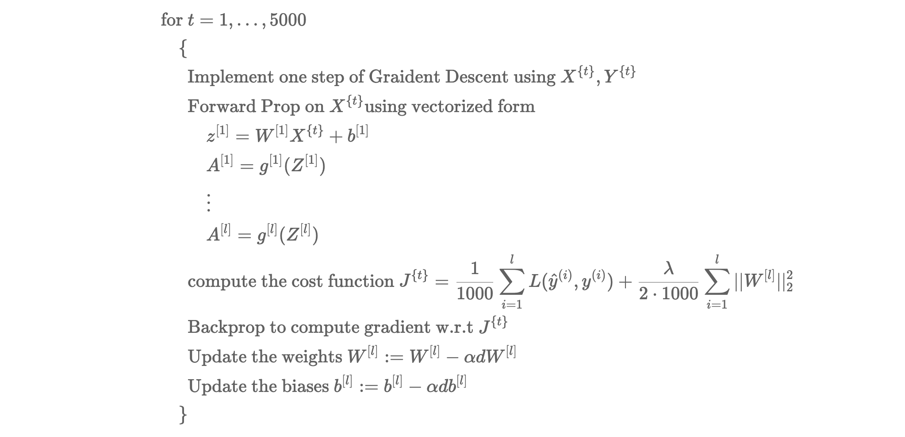
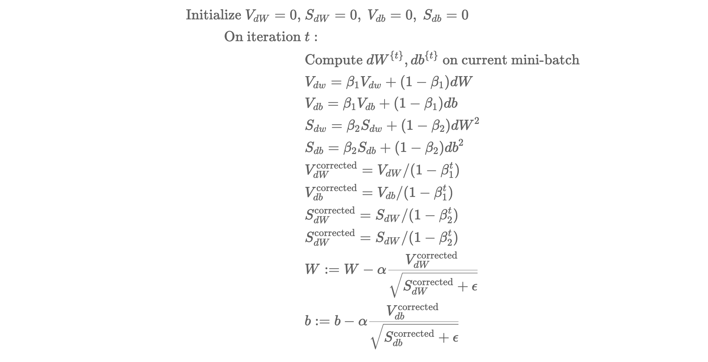

# Optimization Algorithm

## Mini-batch gradient Descent

We know how vectorization allowed us to efficiently compute/process the whole training set of m examples quickly. Let us say that we have m examples, then

$$ X = [x^{(1)}, x^{(2)}, \ldots , x^{(m)}   ] $$

where dimension of $X$ was $(n_x, m)$ and

$$ Y = [y^{(1)}, y^{(2)}, \ldots , y^{(m)}   ]$$

where dimensions of $Y$ was $(1,m)$. 

Now what if the training set is in the range of 5 million? It can get hard for the algorithm to compute those many gradient descents. So what we are going to do is split up the training set into smaller sets and these smaller sets are called **Mini-batches**.

In terms of the above example, we can write the sets as 

where mini-batches are of size $(n_x, 1000)$ and we will have 5000 of them.

where dimensions of $Y$ was $(1, 1000)$ and we will have 5000 of them.

**Mini-batch Gradient Descent**

The above code is doing one epoch of training. It means a single pass through the training set.

## Understanding Mini-batch Graident Descent

The plot of cost vs mini-batch iterations is going to be nosier but will still decrease with iterations.

One of the parameter we need to **choose is the size of the mini-batch**. The ideal size to choose is in between 1 and m. If we choose m as the size of the mini-batch, then we are just taking the whole dataset, and it is equal to doing Batch Gradient Descent. If we choose the size to be 1, then we are only taking one example at a time and that would be equal to doing a Stochastic Gradient Descent. 

$\quad \circ \$ If we have a small training set (less than 2000 examples) - Use Batch Gradient Descent.

$\quad \circ \$ If we have a large training set (larger than 2000 examples) - Use mini-batch Gradient Descent.

$\quad \circ \$ Typical sizes of Mini-Batch are of the power of 2: $64,\ 128,\ 256, \ 512$

$\quad \circ \$ Make sure mini-batch fir in CPU/GPU memory

## Exponentially Weighted Averages

There are some algorithms are that faster than gradient descent, but to study about them, we need to know about exponentially weighted averages.

**Implementing Exponentially weighted averages**

$$ v_0 = 0 $$

$$ v_1 = \beta v_0 + (1-\beta)\theta_1 $$
$$ v_2 = \beta v_1 + (1-\beta)\theta_2 $$
$$ v_3 = \beta v_2 + (1-\beta)\theta_3 $$
$$ \ldots $$

In python

$$ \text{Set } v_{\theta} = 0 $$

$$ \text{Repeat}  $$

$$ \quad \text{Get next }\theta_t $$

$$ \quad v_{\theta} := \beta v_{\theta} + (1-\beta)\theta_t $$

$ \}$

## Bias Correction in Exponentially Weighted Averages

Since the first term is set to equal to 0, it is contributing in some bias. The graph of the weight averages will start from 0 which is quite not right. The actual graph will not start from 0, but might start from some other number. To correct this, we will use something as below: 

$$ \frac{v_t}{1-\beta^t} $$

This new formula will get rid of the bias !! 

Some people do not bother about this bias in the beginning but if we are concerned about this bias, we can use the bias correction to get better estimates.

## Gradient Descent with Momentum

There is an algorithm that works better and faster than normal Gradient Descent, called Gradient Descent with Momentum. In one sentence, the basic idea is to compute an exponentially weighted average and then use that gradient to update your weights instead.

Algorithm is as follows: 

$ \text{On iteration } t: $ 

$$  \text{Compute }dW^{\{t\}}, db^{\{t\}} \text{ on current mini-batch} $$

$$ \text{Compute } V_{dw} = \beta V_{dw} + (1-\beta)dW $$

$$ \text{The above line is computing the moving average of the derivatives for w} $$

$$ \text{Compute } V_{db} = \beta V_{db} + (1-\beta)db $$

$$ W := W -\alpha V_{dw}, \quad b := b -\alpha b V_{db} $$

Consider this example of osicallations in contours of a bowl. In Gradient descent, the oscillations of the gradient could get larger sometimes leading to diverge. The Gradient Descent with Momentum slow down the learning rate in the vertical direction (smaller osicallations) and speed up the learning rate in the horizontal direction (quickly reaches the minimum).

We have two hyperparameters in this algorithm: learning rate $(\alpha)$ and $\beta$ which controls the exponentially weighted averages. The most common value for $\beta$ is 0.9 which is roughly equal to saying that we are averaging over the last 10 gradients.

In practice, people dont use the Bias Correction because after the 10 iterations, the moving average will have warmed up and is no longer a bias esimate.

## RMSprop (Root Mean Square Prop)

There is another algorithm that can speed up gradient descent called RMSprop. Below is the algorithm: 

$ \text{On iteration } t: $

$$ \text{Compute }dW^{\{t\}}, db^{\{t\}} \text{ on current mini-batch} $$ 

$$ S_{dw} = \beta_2 S_{dw} + (1-\beta_2)dW^2 \text{( element-wise squaring)} $$

$$ S_{db} = \beta_2 S_{db} + (1-\beta_2)db^2 $$

$$ W := W -\alpha \frac{dw}{\sqrt{S_{dW} + \epsilon}}, \quad b := b -\alpha \frac{db}{\sqrt{S_{db} + \epsilon}} $$

Similarly as before, consider this example of osicallations in contours of a bowl. In Gradient descent, the oscillations of the gradient could get larger sometimes leading to diverge. The Gradient Descent with Momentum slow down the learning rate in the vertical direction (smaller osicallations) and speed up the learning rate in the horizontal direction (quickly reaches the minimum).

We are adding the $\epsilon$ to the denomenator because we do not want to the deno to be equal to 0 ever.

## Adam Optimization Algorithm

Adam's algorithm is basically putting RMSprop and Gradient Descent with Momentum togther. The algorithm is as follows: 

This algorithm has a number of hyperparameters: 

$\quad \circ \ \alpha$ : Needs to be tuned

$\quad \circ \ \beta_1$ : 0.9 (moving average of weighted average of $dW$). Can tune but not done as often

$\quad \circ \ \beta_2$ : 0.999 (moving average of weighted average of $dW^2$). Can tune but not done as often

$\quad \circ \ \epsilon$ : recommended $10^{-8}$

The name ADAM comes from Adaptive Moment Estimation. Computing $\beta_1$ is called the first moment and computing $\beta_2$ is called the second moment.

## Learning Rate Decay

When we use fixed Learning rate, the descents start to move towards the minimum value, but as they approch the minimum slope, they start to osciallate around the minimum point. Thus having a larger learning rate will make the osciallation bigger around the minimum value. 

If we implement the learning rate decay, making the learning rate smaller at every iteration, it will converge towards the minimum in the beginning at the same rate like before, but as it approches the minimum, the oscillations will get smaller as well. This means that they wander near the minimum more, hence converge better.

**How to Implement learning rate decay**

We know that 1 epoch = 1 pass through the data after applying mini-batch regularization.

We can set $\alpha = \frac{  1  }{  1 + \text{decay-rate} \times \text{epoch}  } \times \alpha_0$

Notice that in the above equation, the "decay-rate" becomes another hyperparameter that we might need to tune. 

For example, $\alpha_0 = 0.2$ and decay-rate $= 1$. Doing several epochs will look like below:

<table style="width:100%">
    <tr>
        <td> <b> Epoch </b> </td> 
        <td> <b> alpha </b>  </td> 
    <tr>
    <tr>
        <td> 1 </td> 
        <td> 0.1 </td> 
    <tr>
    <tr>
        <td> 2 </td> 
        <td> 0.067 </td> 
    <tr>
    <tr>
        <td> 3 </td> 
        <td> 0.0 </td>  
    <tr>
    <tr>
        <td> 4  </td> 
        <td> 0.04 </td> 
    <tr>    
    <tr>
        <td> ... </td> 
        <td> ... </td> 
    <tr>        
</table>

As a function of the epoch number, the learning rate gradually decreases.

### Other Learning rate decay methods

We can use the following $\alpha$'s as our learning rates: 

$$ \alpha = 0.95^{\text{epoch-num}} \cdot \alpha_0 \quad \to \text{exponentially decay}$$ 

$$ \alpha = \frac{k}{ \sqrt{\text{ epoch-num  }} } \cdot \alpha_0 \quad $$ 

$$ \alpha = \frac{k}{ \sqrt{t} } \cdot \alpha_0 \quad $$ 

## The problem of local Optima

In high dimensions, it is possible to get a saddle point or even multiple of them. It is also quiet possible to get a plateaus (surface where the derivative is zero for a long time).

$\quad \circ$ Even tho, it is unlikely to get stuck in a bad local optima.

$\quad \circ$ Plateaus can make learning slow.