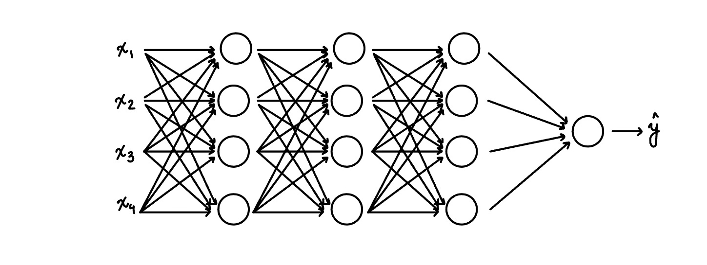
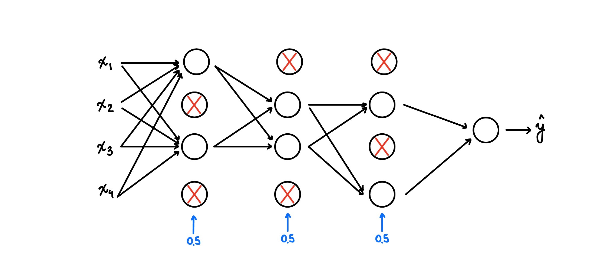

# Regularization

If we suspect that we have a high variance problem, one of the thing that we can do is get more training data, but at times, it is not possible to get more data. So instead, adding regularization will often help to prevent overfitting, or to reduce variance in your network.

Let's develop idea around **Logistic Regression**.

We had the cost function as $J(w,b) = \frac{1}{m} \sum_{i=1}^{m} L(\hat{y}^{(i)}, y^{(i)})$ and we want to minimize it as $\underset{w,b}{\text{min}} J(w,b)$ where $w$ is an x-dimensional parameter vector ($w \in R^{n_x}$), and $b$ is a real number.

To add regularization to logistic regression, we add lambda which is called the regularziation parameter.

$$ J(w,b) = \frac{1}{m} \sum_{i=1}^{m} L(\hat{y}^{(i)}, y^{(i)}) + \frac{\lambda}{2m} ||w^2||_2 $$

where $||w^2||_2 = \sum_{j=1}^{n_x} w_j^2 = w^T\cdot w $

#####################

Check above paragraph

#####################

The above is called the $L_2$ regularization.

We also have $L_1$ regularization, when we add the term: 

$\frac{\lambda}{2m} \sum_{i=1}^{m}|w| = \frac{\lambda}{2m} \sum_{i=1}^{m}||w||_1$

If we use $L_1$ regularization, then $w$ will end up being sparse, i.e. $w$ will have a lot of zeroes.

$\lambda$ is another hyperparameter that you might have to tune. For the programming exercises in Python, the keyword lambda is a reserved keyword. So we will use lambd instead. 

Now lets develop the idea of regularization around the **Neural Networks**

We have the cost function as $J(w^{[1]},b^{[1]}, \ldots , w^{[L]}, b^{[L]}) = \frac{1}{m} \sum\limits_{i=1}^{m} L(\hat{y}^{(i)}, y^{(i)}) + \frac{\lambda}{2m} \sum\limits_{i=1}^{L} ||w^{[L]}||^2 $ where $||w^{[L]}||^2 = \sum\limits_{i=1}^{n^{[l]}} \sum\limits_{j=1}^{n^{[l-1]}} (w_{i,j}^{[l]} )^2 $

###############

Check above 

###############

This matrix norm $||w^{[l]}||^2$ is called the Frobenius Norm of a Matrix, denoted F in the subscript.

**How do we implement Gradient Descent with this?**

Previously, we would complete $dw$ using backprop, where backprop would give us the partial derivative of J with respect to w.

$dw = (\text{from BackProp})\qquad \frac{ \partial J }{ \partial w^{[l]} }$

Then we update $w^{[l]} = w^{[l]} - \alpha \cdot dw^{[l]} $.

Now we will add the regularization terms to the above equations to compensate for the regularziation parameters.

$dw = (\text{from BackProp}) + \frac{\lambda}{2m} w^{[l]} \qquad \frac{ \partial J }{ \partial w^{[l]} }$

$L_2$ regularization is called weight decay.

# Why Regularization Reduces Overfitting?

In other words, why is it that shrinking or reducing the Frobenius norm with the parameters might cause less overfitting? 

One intuition is that if we set $\lambda = $ really big, then we will get $w^{[L]} \approx 0$. Further, this will take us from the case of overfitting to underfitting (high variance $\to$ high bias). Thus, we want to find an intermediate value of $\lambda$ so that final fitting of the datast is "just right" case (from Practical Aspect of Deep Learning first figure).  

Here is the reason why reducing the Frobenius norm will reduce overfitting: 

$\quad \circ \ $ Reducing Frobenius norm is equivalent to increase the value of $\lambda$ and decreasing the value of $w^{[l]}$

$\quad \circ \ $ Since $z^{[l]} = w^{[l]}a^{[l-1]} + b^{[l]}$, reducing the value of $w^{[l]}$ means reducing the value of $z^{[l]}$ (ignoring the effects of $b^{[l]}$). In other words, $z^{[l]}$ will take on relatively small number of values.

$\quad \circ \ $ If we use the activation function $g(z) = \text{tanh}(z)$, then with respect to $z^{[l]}$ it will become linear near the origin (around smaller values).

$\quad \circ \ $ Thus our whole Neural Network will be computing a network which is close to being a linear network (which is pretty simple funcion, not complex).

$\quad \circ \ $ Linear Functions are safe from overfitting the data, thus our overfitting problem is solved.

# Dropout Regularization 

There is another kind of regularization beside $L_1$ and $L_2$ regularization, called Dropout Regularization. With dropout, while going through each of the layers of the network and set some probability of eliminating a node in neural network. For example 

<caption>
<b>Figure 1</b>: Before Dropout Regularization.
</caption>

<caption>
<b>Figure 2</b>: After Dropout Regularization.
</caption>