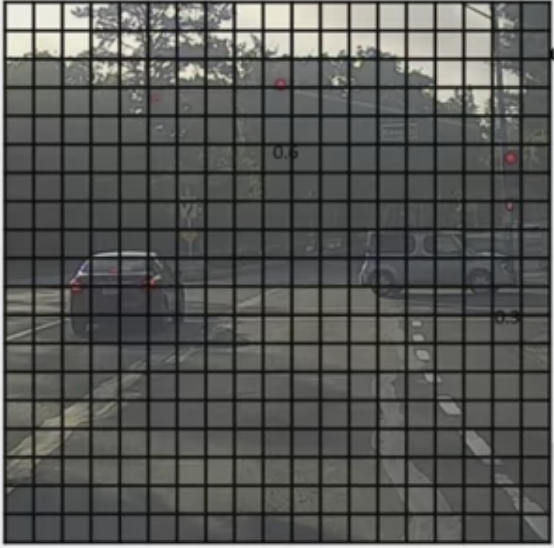

# Object Detection 

In this, we will study about: Object Detection in Computer Vision.

We can detect object in an image by feeding in the algorithm some information about the objects and then let them predict whether the object is in the image or not. To bound a box around the object we can use some variables such as $b_x, b_y, b_h, b_w$ to create lines around the object.

## Landmark Detection

Landmark detection works the same way but has more variables, for example if we are trying to detect a face in an image, then we can create 64 landmarks and place them over the face to detect features (for example eyes, nose, lips, etc.) of the face. In terms of working of the model, we will input an image to the model and then use Convolution layers and at last, we will use the landmarks to detect features.

We will denote the following as landmarks

$$l_{1x},\ l_{1y}$$ 

$$l_{2x},\ l_{2y} $$

$$ \vdots $$ 

$$l_{64x},\ l_{64y} $$

So, the final output of the model will consist of 64x2 + 1 = 129 ouputs where the +1 denotes if there is a face in the image.

## Sliding Window Detection

Lets say we are trying to predict whether an image has a car in it. For that, we can train the model on cropped car images. When we input a bigger or zoomed out image for the model to predict if it has a car in it, we can use **sliding window detector**. In this technique, we use a small window (or box) which slides through all the regions in the image, only sending that window of the whole image to ConvNet to make predictions. We keep the small window sliding unless we have exhausted the whole image in the process. 

There is a huge disadvantage of Sliding Windows Detection, which is the computational cost because we are cropping out so many different square regions in the image and running each of them independently through a ConvNet. If we use a very big stride, then it will reduce the number of windows we need to pass through the ConvNet, but that may hurt performance. Whereas if we use a very small stride, then the huge number of all the little regions we are passing through the ConvNet means that there is a very high computational cost.

## Convolutional Implementation of Sliding Windows

## INSERT IMAGE HERE 

## Bounding Box Prediction

An good algorithm for accurate bounding box prediction is YOLO algorithm (You only look once). In actual implementation we use a grid of 19 x 19 and place the grid on the input image. The basic idea is that we use the image classification and localization algorithm from above, and apply it to each of the grid cells in the image.

So for each of the grid cell, you specify a label $Y$, where the label $Y$ is this 8 dimensional vector, same as previously 
$\begin{pmatrix}p_c & b_x & b_y & b_h & b_w & c_1 & c_2 & c_3\end{pmatrix}^T$. 

The first output $p_c$ depending on whether or not there's an image in that grid cell and then $b_x,\ b_y,\ b_h,\ h_w$ to specify the bounding box if there is an object associated with that grid cell. And then $c_1,\ c_2,\ c_3$ speciy the three classes, for example pedestrian's class, motorcycles and the car class. 

We will go through each of the grid cell and determining the the vector that we formed above.

Once the YOLO algorithm finds grid cells with an object in it, it takes the midpoint of each of the objects and then assigns the object to the grid cell containing the midpoints. The object are assigned to grid cells according to their where their midpoints lies. 

Just for example, for each of these nine grid cells in the following image, we will end up with a eight dimensional output vector. 

## YOLO Algorithm

The total volume of the target output is going to be 3x3x8 because we have 3 by 3 grid cells and for each of the 3 by 3 grid cells, we have a 8 dimensional $Y$ vector. So now, to train the neural network, the input image is 100 by 100 by 3. And then we have a usual convnet with CONV layers of max pool layers, and so on. In the end, so the ConvNet eventually maps to a 3 by 3 by 8 output volume.

In practice, we use a 19x19 grid cells and the output volume comes out to be 19x19x8.

**Specifying the bounding boxes**

The $b_x,\ b_y,\ b_h, b_w$ are specified relative to the grid cells as following

## Insert SPECIFYING THE BOUNDING BOXES IMaGE

$b_x,\ b_y$ has to be between 0 and 1 whereas $b_h,\ b_w$ can be greater than 1.

## Intersection over Union 

Suppose you have an algorithm that is predicting the following bounding box of the object in the image.

## Insert image here

Then 

$$ IOU = \frac{ \text{size of the intersection (yellow)} }{ \text{size of the union} } $$

If the answer to the above is greater than 0.5, then the bounding box is is doing a good job.

If the predicted and the bounding boxes overlapped perfectly, the IoU would be 1 because the intersection would equal to the union.

## Non-Max Supperssion

One of the problems of Object Detection is that our algorithm may find multiple detections of the same objects. Rather than detecting an object just once, it might detect it multiple times. **Non-max suppression** is a way for you to make sure that your algorithm detects each object only once. 

Suppose we have the following image: 

To implement non-max suppression, the first thing we will do is discard all the boxes, or discard all the predictions of the bounding boxes with $p_c \leq $ threshold (say 0.6). So we're going to say that unless you think there's at least a 0.6 chance it is an object there, let's just get rid of it. Then if there are still multiple boxes remaining, then we look at the value of their $p_c$ or IOU, and choose the one with the highest value. We discard the other boxes.

The above algorithm is for detecting just a single object in the image. If we  tried to detect three objects say pedestrians, cars, and motorcycles, then the output vector will have three additional components. And the right thing to do is to independently carry out non-max suppression three times, one on each of the outputs classes. 

## Anchor Boxes 

What if a grid cell wants to detect multiple objects? In that case, we can use Anchor Boxes. With the idea of anchor boxes, we can pre-define two different shapes called, anchor boxes and can be able to associate two predictions with those two anchor boxes. And in general, we might use more anchor boxes, for example 5 or more. We will have a $Y$ output where instead of 8 entires, we will double those entires. Each set of entries will represent the anchor boxes shapes and the associated objects.

## YOLO Algorithm

Suppose we are trying to train an algorithm to detect three objects: pedestrians, cars, and motorcycles. Thus we will have 3 class labels. If you're using two anchor boxes, then the outputs $y$ will be $3x3x2x8$. $3x3$ because we are using $3x3$ grid cell, 2 because this is the number of anchors boxes we are using, and 8 because that's the number of $p_c, b_x, b_y, b_h, b_w, c_1, c_2, c_3$.

Then we go through for each of your nine grid cells in the image, and come up with a 16 dimensional vector $\begin{pmatrix}p_c & b_x & b_y & b_h & b_w & c_1 & c_2 & c_3 & p_c & b_x & b_y & b_h & b_w & c_1 & c_2 & c_3\end{pmatrix}^T$. That's why the final output volume is going to be 3 by 3 by 16. In practice we will use a grid cells of 19x19. 

So to the train ConvNet, lets inputs an image of 100 by 100 by 3, and then then the ConvNet would  finally output this output volume in our example, $3 x 3 x 16$. Then it will run through each of the grid cells finding objects. When it finally finds one it will output $p_c = 1$ along with some numbers in the output volume which gives an accurate bounding boxes. Once it has made predictions, we will make it run through non-max suppression. 

If we are using two anchor boxes, then for each of the 9 grid cells, we will get two predicted bounding boxes. Some of them will have very low probability, $p_c$. Some of the bounding boxes can go outside the height and width of the grid cell that they came from. Then we get rid of the low probability predictions. 

Then for the number of classes you have, for each of those classes, independently run non-max suppression for the objects that were predicted to come from that classes to generate the final predictions.

## Semantic Segmentation with U-Net

The goal of Semantic Segmentation is to draw a careful outline around the object that is detected so that we know exactly which pixels belong to the object and which pixels don't. 

## Insert the semantic seg image here (Draw it first)

In the ConvNet Architeture we have looked so, as we go left to right, the width and length decrease and the depth increases. In the Semantic Segmentation, after a certain number of layers, the length and width starts to increase back to the origianl input shape and the depth starts to decrease to the original shape. 

The reversal of the shape is done through transpose convolutions.

## INsert normal convultion image

Here is what transpose convolution does
## INsert transpose convultion example image

## U-Net Architecture

The is the architecture of a U-Net 

*****Insert the image of architect here 

Skip connection is not a part of the U-Net but we can add it to get better and more accurate predictions. We can copy the block of activations from the first block directly to the second to last block